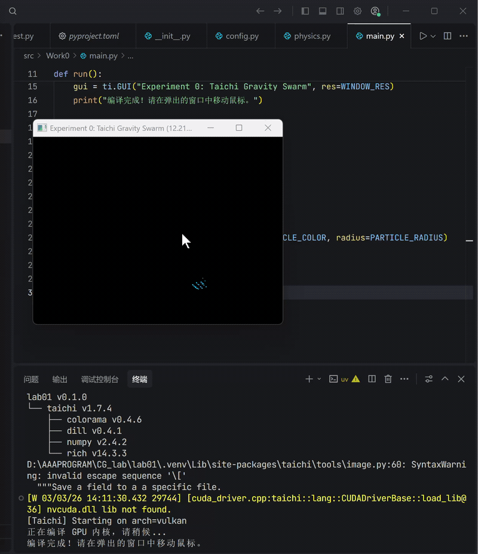

# BNU_CG_Lab01：万有引力粒子群仿真

本仓库为北京师范大学计算机图形学课程实验项目，基于Taichi框架实现万有引力粒子群的GPU并行仿真与交互渲染，完成了从开发环境搭建到代码模块化重构、GPU 加速计算及代码托管的全流程任务。

## 项目概述
本次实验围绕”万有引力粒子群仿真“展开，核心目标是：
1. 搭建标准化的图形学开发环境（Trae IDE+uv）；
2. 基于 Taichi 实现 GPU 加速的粒子群物理仿真；
3. 采用模块化设计重构代码，实现可交互的粒子渲染效果；
4. 完成代码的 Git 托管与项目文档规范化。

## 开发环境与工具链
### 核心工具
- **IDE**：Trae IDE
- **包管理器**：uv
- **核心框架**：Taichi
- **版本控制**：Git + GitHub

### 项目架构
```text
BNU_CG_Lab/Lab01/      
├── demo/      
    ├── lab01.gif           # 实验演示gif
├── src/
│   └── Work0/           
│       ├── __init__.py    
│       ├── config.py       # 配置
│       ├── physics.py      # 物理引擎
│       ├── main.py         # 模块入口
│       └── test.py         # 单元测试
├── .gitignore             
├── .python-version         
├── pyproject.toml          # 项目依赖配置
└── uv.lock                 # uv依赖锁定文件
```

## 效果展示
### 万有引力粒子群仿真演示

