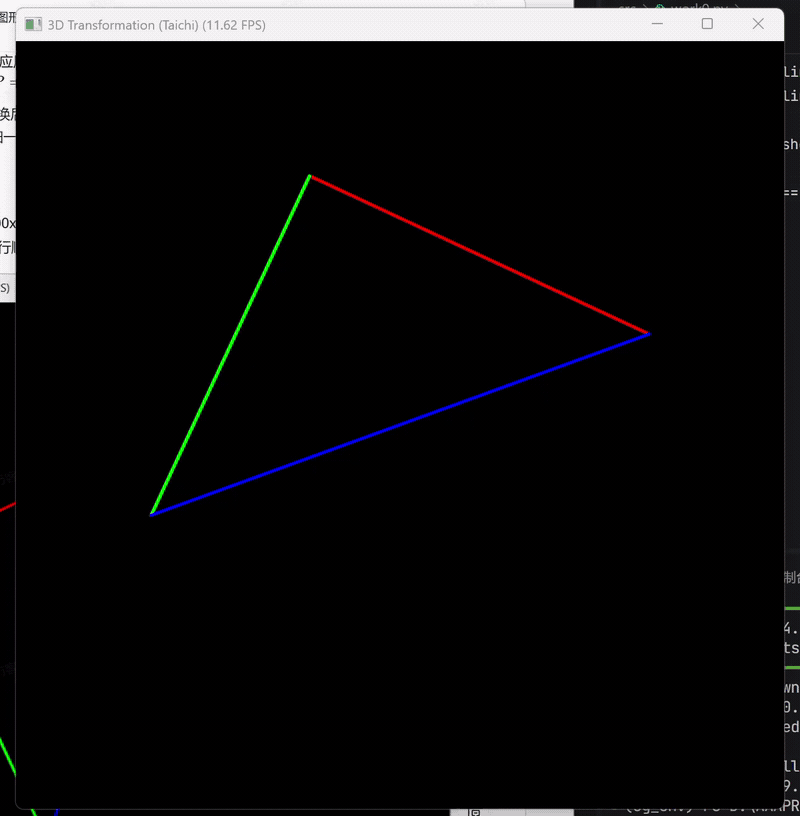

# Lab02: 旋转与变换

## 实验说明

本实验基于 Taichi 实现三维空间中的模型变换、视图变换和投影变换，并将三维顶点映射到二维屏幕坐标进行线框绘制。

- 实验内容：绘制并旋转三角形，完成 `Model`、`View`、`Projection` 三个矩阵的推导与代码实现。
- 选做内容：构建立方体线框，在透视投影下进行三维旋转显示，观察更明显的空间层次感。

## 运行环境

本实验代码在 Conda 虚拟环境 `cg_env` 中完成。

```bash
conda activate cg_env
cd D:\AAAPROGRAM\CG_lab\lab02
```

运行方式：

- 必做三角形版本：`python main.py`
- 选做立方体版本：`python optional_main.py`

按键说明：

- `A`：逆时针旋转
- `D`：顺时针旋转
- `Esc`：退出程序

## 代码结构

```text
lab02/
├── demo/
│   ├── lab02.gif
│   └── lab02_pro.gif
├── src/
│   ├── work0.py
│   └── work1_cube.py
├── main.py
├── optional_main.py
└── README.md
```

各文件功能如下：

- `main.py`：三角形部分程序入口，可以启动三角形 MVP 变换与线框绘制。
- `optional_main.py`：3D立方体部分程序入口，启动三维立方体线框透视旋转。
- `src/work0.py`：三角形部分代码，包含三角形顶点初始化、MVP 矩阵构造、透视除法和 GUI 绘制逻辑。
- `src/work1_cube.py`：3D立方体代码，包含立方体 8 个顶点、12 条边定义，以及复合旋转下的透视投影绘制。
- `demo/`：README 中展示的实验演示 GIF。

## 三角形旋转与变换

### 1. 模型变换矩阵 `get_model_matrix(angle)`

在必做部分中，模型矩阵实现的是绕 `Z` 轴的旋转变换。输入角度先从角度制转换为弧度制，再利用三角函数构造旋转矩阵：

```math
M_{model} =
\begin{bmatrix}
\cos\theta & -\sin\theta & 0 & 0 \\
\sin\theta & \cos\theta & 0 & 0 \\
0 & 0 & 1 & 0 \\
0 & 0 & 0 & 1
\end{bmatrix}
```

### 2. 视图变换矩阵 `get_view_matrix(eye_pos)`

视图矩阵的作用是将相机平移到世界坐标原点。实验中相机位置设为 `(0, 0, 5)`，因此视图变换本质上是一个平移矩阵。

### 3. 投影变换矩阵 `get_projection_matrix(...)`

投影矩阵分两步构造：

- 先将透视平截头体压缩到正交长方体。
- 再进行正交投影，将空间映射到标准立方体范围。

在实现中使用了如下边界计算公式：

```math
t = \tan(\frac{fov}{2}) \cdot |n|,\quad
b = -t,\quad
r = aspect\_ratio \cdot t,\quad
l = -r
```

最终整体变换顺序为：

```math
MVP = M_{projection} \cdot M_{view} \cdot M_{model}
```

对顶点完成变换后，再进行透视除法，将齐次坐标归一化到 NDC 空间，最后映射到 GUI 的二维屏幕坐标。

## 3D立方体的旋转与变换

这一部分在基础实验上进一步扩展为三维立方体线框旋转显示。

- 构建了一个中心位于原点、边长为 `2` 的立方体。
- 定义了 `8` 个顶点和 `12` 条边。
- 在模型变换中叠加了绕 `Y` 轴和 `X` 轴的复合旋转。
- 通过透视投影将立方体映射到二维窗口中，得到更明显的近大远小效果。

这样可以直观看到视图变换与透视投影在三维空间中的作用。

## 演示效果

### 三角形



### 3D立方体


## 总结

通过本次实验，完成了从三维顶点到二维屏幕坐标的完整 MVP 变换流程实现，并在 Taichi 中实现了基础三角形旋转和选做立方体透视旋转，为后续图形学中的光栅化、相机系统和三维渲染打下了基础。
