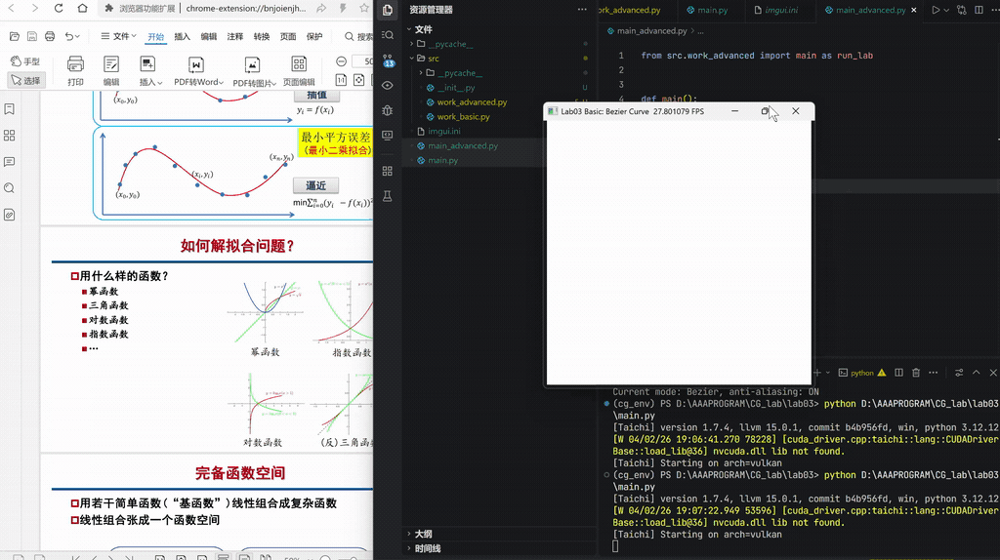
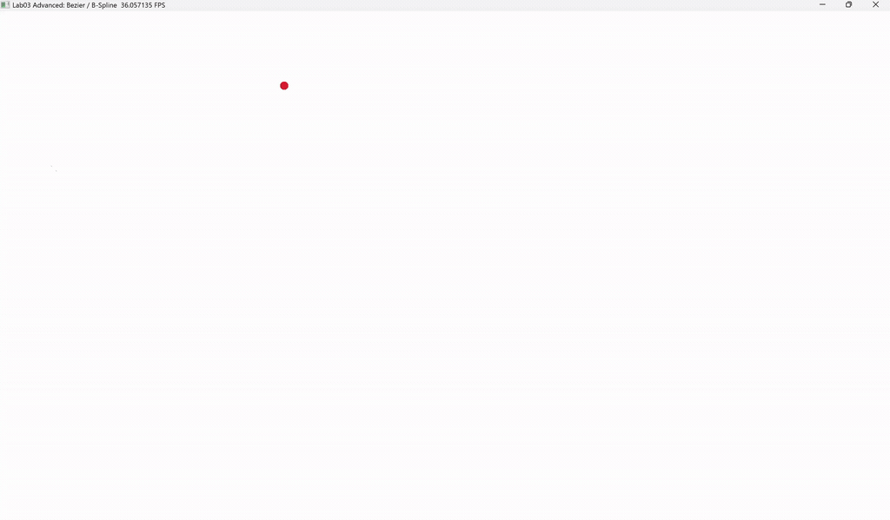

# Lab03: 贝塞尔曲线

## 实验概述

本实验使用 Python和Taichi 实现二维曲线的交互式绘制，可以分为基础部分和选做部分。

- 基础部分实现了基于De Casteljau算法的Bézier曲线绘制;
- 选做部分在基础渲染管线之上，进一步实现了反走样曲线渲染，以及均匀三次B样条曲线的绘制。

整个程序围绕“CPU 负责曲线采样，GPU 负责像素光栅化”这一思路组织：

- CPU 端根据控制点计算曲线上一系列采样点。
- 采样点通过 `from_numpy(...)` 批量传入 Taichi Field。
- GPU Kernel 再将这些采样点映射到像素缓冲区中，完成最终显示。

## 运行方式

进入 `lab03` 目录后，有：
- 基础部分：`python main.py`
- 选做部分：`python main_advanced.py`


## 交互说明(长按ctrl键再操作)

### 基础部分

- 鼠标左键：添加控制点
- `C`：清空当前控制点并重置画布

### 选做部分

- 鼠标左键：添加控制点
- `C`：清空当前控制点并重置画布
- `B`：在 Bézier 曲线模式与均匀三次 B 样条曲线模式之间切换

## 项目结构

```text
lab03/
├── demo/
│   ├── lab03_advanced.gif
│   └── lab03_basic.gif
├── src/
│   ├── work_advanced.py
│   ├── work_basic.py
│   └── __init__.py
├── main.py
├── main_advanced.py
└── README.md
```

## 基础部分实现说明

### 1. De Casteljau 算法

基础部分的核心是 `src/work_basic.py` 中的 `de_casteljau(points, t)`。  
它的思想是对控制点反复进行线性插值，先对相邻控制点做插值，得到一组新的点；再对新得到的点继续做插值。重复以上过程，直到只剩下1个点。
最后剩下的这个点，就是参数 `t` 对应的曲线点。

### 2. CPU 采样与 GPU 绘制分离

程序中预先分配了以下固定大小的 Taichi Field：

- `pixels`：`800 x 800` 的RGB像素缓冲区
- `curve_points_field`：用于接收CPU计算好的曲线采样点
- `gui_points`：用于绘制控制点的对象池
- `polygon_line_points`：用于绘制控制多边形的顶点池

在主循环中：
若控制点数量不少于2个时，CPU会采样1001个曲线点；这些采样点通过 `from_numpy(...)` 一次性传入 `curve_points_field`。GPU Kernel将归一化坐标映射到像素索引并点亮绿色像素。
这种批处理方式可以减少每算出1个点就跨CPU和GPU修改显存的高开销问题。


## 选做部分实现说明

### 1. 反走样曲线渲染

基础版中，曲线采样点会被直接转换为整数像素坐标，只点亮单一像素。  
这种做法会让斜线或曲线边缘出现明显的锯齿，也就是常说的“台阶化”。

选做部分引入了一个额外的 `coverage` 覆盖率缓冲区：

- 对于每个曲线采样点，先保留其浮点像素坐标。
- 再考察该点周围 `3 x 3` 邻域中的像素。
- 根据像素中心与曲线点之间的距离，计算一个高斯衰减权重。
- 将这个权重写入覆盖率缓冲区。
- 最后根据覆盖率，把背景色和曲线颜色做线性混合。

这样一来，曲线不会只落在单独一个像素上，而是会对附近多个像素产生不同强度的影响，从而让边缘过渡更平滑。

### 2. 均匀三次 B 样条曲线

与Bézier曲线相比，B样条曲线局部控制性更强,且控制点数量增加时，不需要同步提升整条曲线的多项式阶数。
本实验中采用的是均匀三次 B 样条的矩阵形式。  
每 4 个相邻控制点构成 1 段局部曲线，局部参数 `u` 对应的点通过固定基矩阵计算：

```math
P(u) = [u^3 \quad u^2 \quad u \quad 1] \cdot M_{B\text{-spline}} \cdot G
```

其中：

- `M_{B-spline}` 是均匀三次 B 样条的基矩阵
- `G` 是当前 4 个控制点组成的几何矩阵

如果一共有 `n` 个控制点，那么整条曲线会被分成 `n - 3` 段。  
程序会在 CPU 端遍历所有分段，采样后统一汇总到 `curve_points_field`，再交给 GPU 绘制。

### 3. 模式切换设计

为了方便对比 Bézier 曲线与 B 样条曲线的几何差异，选做程序增加了曲线模式变量：

- 默认模式是 Bézier
- 按下 `B` 键，同时按住ctrl键，可切换到 B 样条模式
- 再次按下 `B` 键，同时按住ctrl键，可切回 Bézier 模式

这样可以在同一组控制点下直接观察两种曲线的形态差异。

## 代码文件说明

- `main.py`：基础部分主函数，启动Bézier曲线实验
- `src/work_basic.py`：基础部分实现，包括De Casteljau采样、像素光栅化和交互逻辑等等
- `main_advanced.py`：选做部分主函数
- `src/work_advanced.py`：选做部分实现，包括反走样渲染、B样条采样与模式切换
- `demo/`：用于在README中展示实验运行效果的GIF文件

## Demo

### 基础部分 GIF 链接

- [lab03_basic.gif](demo/lab03_basic.gif)



### 选做部分 GIF 链接

- [lab03_advanced.gif](demo/lab03_advanced.gif)



## 实验总结

通过本次实验，可以比较完整地理解一条交互式曲线从数学定义到计算机图形绘制的完整过程，包括：

- De Casteljau 算法生成 Bézier 曲线的几何过程
- 像素缓冲区和光栅化思想
- 用 Taichi Kernel 体会 GPU 并行绘制的优势
- 对象池和批量拷贝的思想
- 对反走样和 B 样条的比较，能让我进一步观察更接近真实图形系统的渲染与建模思想

基础部分完成了实验的核心要求，选做部分则进一步扩展了渲染质量和曲线类型，对比效果更加直观。
