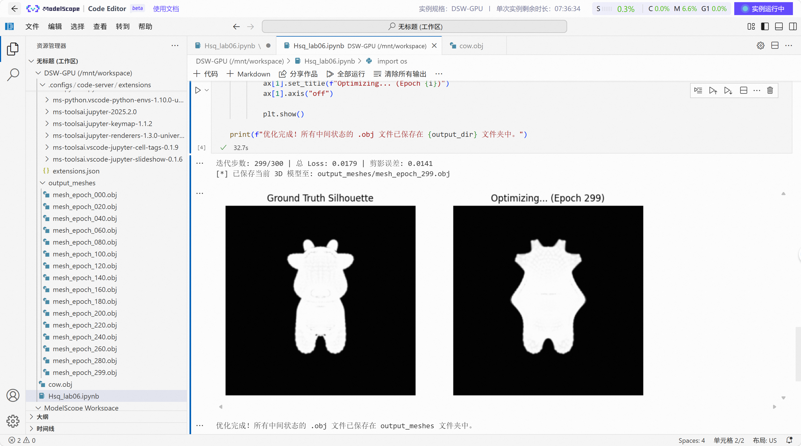
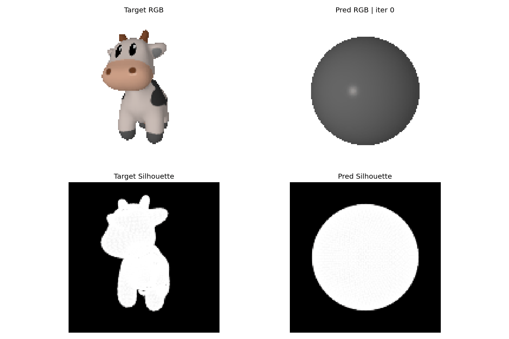

# Lab06: Differentiable Rasterization Mesh Fitting
姓名：黄诗淇 学号：202411081063 专业：计算机科学与技术

本仓库提交的是实验六的notebook，代码与运行结果均保存在 [Hsq_lab06.ipynb](Hsq_lab06.ipynb) 中。实验在魔塔社区的云平台GPU环境完成，仓库中保留了基础部分、选做部分以及所有中间输出模型。

## 实验内容

### 基础部分：剪影驱动的形状优化

基础部分使用 PyTorch3D 的可微软剪影渲染，将初始 `ico_sphere` 通过梯度下降拟合到奶牛模型的多视角剪影。

核心流程：

- 读取 `cow.obj`，归一化目标奶牛网格。
- 使用多个相机视角渲染目标剪影。
- 初始化球体网格，并将 `deform_verts` 作为可学习参数。
- 使用 `SoftSilhouetteShader` 计算预测剪影。
- 使用剪影 MSE 作为主损失。
- 加入三项网格正则化：`mesh_laplacian_smoothing`、`mesh_edge_loss`、`mesh_normal_consistency`。
- 定期保存中间优化结果 OBJ。

损失函数：

```math
L = L_{silhouette}
  + w_{lap}L_{lap}
  + w_{edge}L_{edge}
  + w_{normal}L_{normal}
```

### 选做部分：联合形状与纹理优化

选做部分参考 PyTorch3D 官方教程 [fit_textured_mesh.ipynb](https://github.com/facebookresearch/pytorch3d/blob/main/docs/tutorials/fit_textured_mesh.ipynb)，在剪影拟合的基础上加入 RGB 图像拟合。

核心流程：

- 使用 `cow.obj + cow.mtl + cow_texture.png` 加载带真实纹理的目标奶牛。
- 使用 `SoftPhongShader` 渲染多视角目标 RGB 图像。
- 使用 `SoftSilhouetteShader` 渲染多视角目标剪影。
- 从 `ico_sphere` 出发，同时优化：
  - `deform_verts`：源网格顶点形变。
  - `sphere_verts_rgb`：源网格顶点颜色。
- 每隔固定迭代次数保存带顶点颜色的 OBJ、中间普通 OBJ 和可视化帧。
- 最终合成优化过程 GIF。

## Demo
### 目标剪影图


### 联合纹理优化过程



原始 GIF 也保留在：

```text
outputs/output_textured_meshes/texture_optimization.gif
```

## 运行环境

使用的是阿里云魔塔社区的云平台环境：

```text
Ubuntu 22.04
CUDA 12.8
Python 3.11
PyTorch 2.9.1
GPU 显存 24 GB
```

notebook PyTorch3D 安装方式：

```python
!pip install --upgrade pip
!pip install fvcore iopath matplotlib ninja
!pip install "git+https://gitee.com/hongwenzhang/pytorch3d.git" --no-build-isolation
```

## 如何复现实验

在云平台或其他支持 CUDA 的 notebook 环境中打开：

```text
Hsq_lab06.ipynb
```

按顺序运行 notebook 中的 cell 即可。数据文件已经放在 `data/` 目录中，如果在 notebook 当前目录运行，需要确保以下文件与 notebook 路径一致，或在代码中修改路径：

```text
data/cow.obj
data/cow.mtl
data/cow_texture.png
```

基础部分输出目录：

```text
outputs/output_meshes/
```

选做部分输出目录：

```text
outputs/output_textured_meshes/
```

## 输出说明

### 基础部分输出

`outputs/output_meshes/` 中保存了剪影拟合过程的中间 OBJ：

```text
mesh_epoch_000.obj
mesh_epoch_020.obj
...
mesh_epoch_299.obj
```

这些文件对应球体逐步被优化成奶牛剪影形状的中间结果。

### 选做部分输出

`outputs/output_textured_meshes/` 中保存了联合纹理优化的完整过程：

- `colored_mesh_epoch_*.obj`：早期选做测试阶段保存的带顶点颜色 OBJ。
- `colored_mesh_iter_*.obj`：正式纹理优化过程中的带顶点颜色 OBJ。
- `mesh_iter_*.obj`：正式纹理优化过程中的普通 OBJ。
- `final_colored_textured_fit.obj`：最终带顶点颜色的优化模型。
- `final_plain_mesh.obj`：最终普通 OBJ。
- `texture_optimization.gif`：RGB 与剪影联合优化过程 GIF。
- `gif_frames/`：合成 GIF 使用的逐帧图片，已保留。

## 文件结构

```text
lab06/
├── Hsq_lab06.ipynb
├── README.md
├── data/
│   ├── cow.glb
│   ├── cow.obj
│   ├── cow.mtl
│   ├── cow_texture.png
│   └── README.md
├── demo/
│   └── texture_optimization.gif
└── outputs/
    ├── output_meshes/
    │   └── mesh_epoch_*.obj
    └── output_textured_meshes/
        ├── colored_mesh_epoch_*.obj
        ├── colored_mesh_iter_*.obj
        ├── mesh_iter_*.obj
        ├── final_colored_textured_fit.obj
        ├── final_plain_mesh.obj
        ├── texture_optimization.gif
        └── gif_frames/
```

## 提交说明

本次 GitHub 提交以 notebook 为主：

- 代码实现：`Hsq_lab06.ipynb`
- 目标模型与纹理：`data/`
- 基础实验结果：`outputs/output_meshes/`
- 选做实验结果与 GIF：`outputs/output_textured_meshes/`
- README 展示动图：`demo/texture_optimization.gif`

保留了云平台生成的中间模型、最终模型、GIF 帧图，便于检查优化过程。
